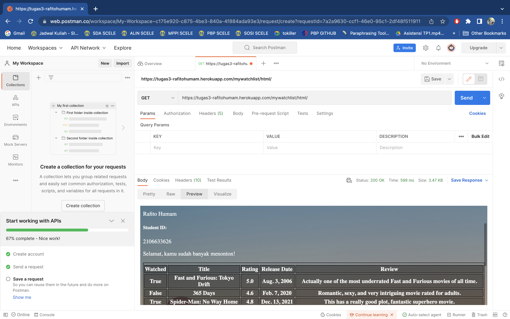
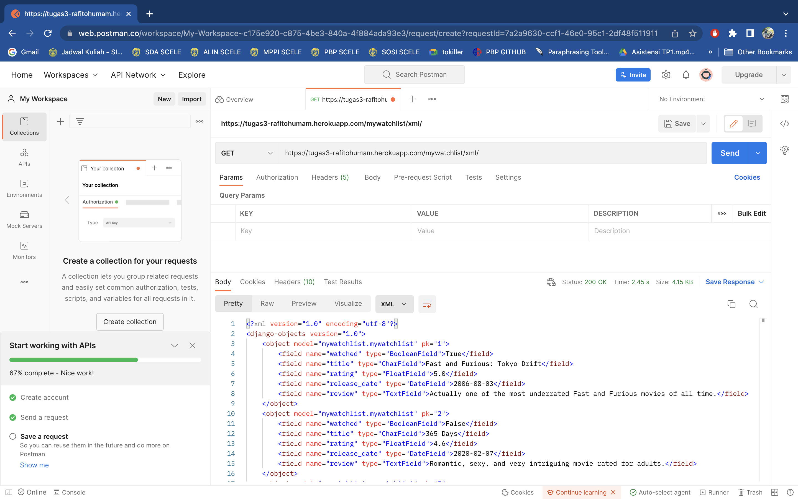
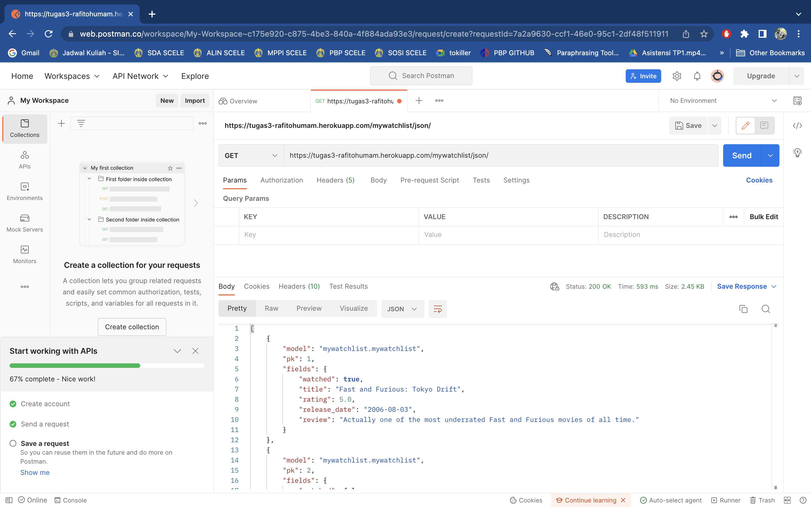

# Assignment - Tugas 3

## Rafito Humam Abrar - 2106633626
## PBP E

Berikut saya lampirkan link dari aplikasi yang berhasil di-*deploy* ke Heroku.

[LINK APLIKASI TUGAS 3](https://tugas3-rafitohumam.herokuapp.com/mywatchlist/ "App Heroku Tugas 3 - Watchlist")

## Perbedaan JSON, XML, dan HTML

JSON (*JavaScript Object Notation*), XML (*Extensible Markup Language*), dan HTML (*HyperText Markup Language*) merupakan jenis bahasa yang digunakan untuk melakukan *data delivery* sebagai template dari sebuah aplikasi berstruktur MVT. Ketiga jenis tersebut merupakan sebuah pemetaan dari *query* dengan struktur pembahasan yang berbeda. Pada *website* umumnya, pemetaan *models* dilakukan dengan HTML.

Adapun perbedaan JSON, XML, dan HTML terdapat di struktural dan *formatting* *data delivery* dari sebuah *content*. HTML, berjenis *Markup Language* dengan ciri-ciri menggunakan tag (<) atau (>) yang digunakan untuk menentukan urutan urgensi teks dan tampilannya. HTML dapat lebih mudah dikostumisasi secara visual dan akan lebih memanjakan mata *user*. HTML bersifat *case insensitive*.

Sementara itu, XML yaitu *Extensible Markup Language* didesain menjadi suatu bahasa *markup* yang terstruktur dan *self-descriptive*. Ciri khas dari XML adalah membentuk sebuah "pohon" pada bahasa tersebut yang berurutan dari akar, batang, dan para ranting. XML akan membuat *user* dan komputer lebih mudah mengerti untuk tentang informasi yang hendak disampaikan oleh aplikasi tersebut. XML umumnya digunakan untuk mengirimkan atau menyimpan data pada banyak aplikasi. XML bersifat *case sensitive*.

Berbeda dengan XML, JSON atau *JavaScript Object Notation* didesain menjadi suatu bahasa, sebuah format data dengan sebuah *text* yang *self-describing* sehingga memiliki tingkat efisiensi penempatan elemen yang lebih tinggi dibandingkan XML. JSON menempatkan elemen dalam dua bentuk, yaitu *key* dan *value* dan mmeiliki tendensi untuk lebih ringkas dan cepat dibandingkan XML.

## Perlunya Data Delivery Dalam Pengimplementasian Sebuah Platform

Hal ini harus dikembalikan pada esensi aplikasi dengan tipe MVT atau *Model-View-Template* Pada awalnya, *user* sebagai *client* dari server Django akan melakukan sebuah permintaan yang ditangkap oleh `urls.py`. Kemudian, `urls.py` akan meneruskan permintaan tersebut kepada `views.py` dengan serangkaian fungsi yang didefinisikan oleh *developer* di dalam `views.py`. Sesuai dengan permintaan dan jalannya program, `views.py` akan melakukan pengambilan data berupa *query* ke `models.py` dan dikembalikan langsung ke `views.py`. Setelah permintaan tersebut berhasil dilaksanakan, maka program tersebut akan memetakan data tersebut ke sebuah *template*, dalam kasus ini diwakilkan oleh `katalog.html`, dan pada akhirnya dikembalikan ke *user* sebagai sebuah respons yang sesuai.

Aplikasi dengan tipe MVT ini menjadi suatu landasan berfikir dalam konsep pembuatan *platform* dasar. Implementasi *data delivery* pada sebuah *platform* memiliki peran yang sangat penting karena *platform* secara kontinu akan melakukan transfer data antar *user*, *client*, dan *server*. Proses ini akan sangat dipermudah ketika *delivery* dari data yang diantisipasi dapat secara konsisten memiliki format yang sama. Sesuai dengan kebutuhan efisiensi setiap *platform*, maka pemilihan format *delivery* harus diperhitungkan secara benar antara HTML, XML, maupun JSON.

## Implementasi Alur Tugas

Pada awal mula, perlu didefinisikan sebuah aplikasi baru pada repositori lokal. Hal ini dapat dilakukan dengan mengetikkan *command* berikut:
```shell
python3 manage.py startapp mywatchlist
```
di dalam sebuah *virtual environment* yang telah dijalankan dengan perintah:
```shell
source env/bin/activate
```

Setelah ini dilakukan, maka dalam repositori lokal akan terbentuk sebuah folder aplikasi bernama `mywatchlist`.

Selanjutnya tambahkan path mywatchlist di `urls.py` yang berada di folder `prodject_django` seperti berikut:
```shell
urlpatterns = [ ... path('mywatchlist/', include('mywatchlist.urls')), ]
```
Dan tambahkan di `INSTALLED_APPS` pada file `settings.py` dengan kode:
```shell
INSTALLED_APPS = [ 
..., 
'mywatchlist', 
]
```

Kemudian, lakukan setup untuk aplikasi tersebut dengan melakukan beberapa perubahan ke file berikut:

### views.py

Penyuntingan pada file `views.py` untuk melakukan pengambilan data dari `models.py` dan dipetakan ke *template* dalam file HTML ataupun XML dan JSON dengan *serializer*. Selain itu, dibuat juga sebuah fungsi `watch_count` untuk mengimplementasi soal bonus yang mengeluarkan *output* berdasarkan jumlah film yang tertonton, seperti berikut:

```python
from django.shortcuts import render
from mywatchlist.models import MyWatchList
from django.http import HttpResponse
from django.core import serializers

def show_watchlist(request):
    data_watchlist = MyWatchList.objects.all()
    context = {
    "list_film": data_watchlist,
    "nama": "Rafito Humam",
    "npm" : "2106633626",
    "watched_count": 0,
    "not_watched_count": 0,
    "movie_count": ""
    }
    watch_count(context)
    return render(request, "mywatchlist.html", context)

def watch_count(content):
    for i in content.get("list_film"):
        if i.watched == True:
            content["watched_count"] += 1
        if i.watched == False:
            content["not_watched_count"] += 1
    if content["watched_count"] >= content["not_watched_count"]:
        content["movie_count"] = "Selamat, kamu sudah banyak menonton!"
    else:
        content["movie_count"] = "Wah, kamu masih sedikit menonton!"

def show_xml(request):
    data_watchlist = MyWatchList.objects.all()
    return HttpResponse(serializers.serialize("xml", data_watchlist), content_type="application/xml")

def show_json(request):
    data_watchlist = MyWatchList.objects.all()
    return HttpResponse(serializers.serialize("json", data_watchlist), content_type="application/json")

def show_xml_id(request, id):
    data_watchlist = MyWatchList.objects.filter(pk=id)
    return HttpResponse(serializers.serialize("xml", data_watchlist), content_type="application/xml")

def show_json_id(request, id):
    data_watchlist = MyWatchList.objects.filter(pk=id)
    return HttpResponse(serializers.serialize("json", data_watchlist), content_type="application/json")
```
### models.py

Kemudian, ada file `models.py` yang berfungsi untuk mendefinisikan setiap model berupa atribut-atribut yang diesuaikan pada soal seperti *watched*, *title*, *rating*, *release_date*, dan *review* dengan field yang sesuai masing-masing. Atribut ini nantinya akan digunakan  pada file `initial_watchlist_data.json` pada folder `fixtures`.

```python
from django.db import models

class MyWatchList(models.Model):
    watched = models.BooleanField()
    title = models.CharField(max_length=255)
    rating = models.FloatField()
    release_date = models.DateField()
    review = models.TextField()
```

Setelah itu, tidak lupa melakukan migrasi dengan menjalankan kode berikut:
```shell 
python3 manage.py makemigrations
python3 manage.py migrate
```

### initial_watchlist_data.json

Pada file ini, didefinisikan data tentang `watchlist` yang nantinya akan ditampilkan di dalam web tentang film (minimal 10). Atribut yang digunakan harus sesuai dengan yang didefinisikan pada `models.py`, seperti berikut:

```
[
    {
        "model": "mywatchlist.MyWatchList",
        "pk": 1,
        "fields": {
            "watched": true,
            "title": "Fast and Furious: Tokyo Drift",
            "rating": 5.0,
            "release_date": "2006-08-03",
            "review": "Actually one of the most underrated Fast and Furious movies of all time."
        }
    },
    {
        "model": "mywatchlist.MyWatchList",
        "pk": 2,
        "fields": {
            "watched": false,
            "title": "365 Days",
            "rating": 4.6,
            "release_date": "2020-02-07",
            "review": "Romantic, sexy, and very intriguing movie rated for adults."
        }
    },
...
```

### urls.py

Untuk melakukan *routing* dari fungsi yang terdapat `views.py` tersebut, perlu dilakukan konfigurasi dari `urls.py` yang dalam bentuk final memiliki isi sebagai berikut:

`urls.py` pada folder `mywatchlist`
```python
app_name = "mywatchlist"

urlpatterns = [
    path("", show_watchlist, name="show_watchlist"),
    path("html/", show_watchlist, name="show_watchlist"),
    path("xml/", show_xml, name="show_xml"),
    path("json/", show_json, name="show_json"),
    path("xml/<int:id>", show_xml_id, name="show_xml_id"),
    path("json/<int:id>", show_json_id, name="show_json_id"),
]
```

### mywatchlist.html (template)

Finalisasi terakhir dilakukan dengan mengkostumisasi file html agar dapat dipetakan dengan baik dalam web, selain itu ditampilkan juga variabel `movie_count` sebagai pemberitahu tentang banyaknya film yang telah ditonton, sebagai berikut:

```shell
  <h1>Tugas 3 Assignment PBP/PBD</h1>

  <h5>Name: </h5>
  <p>{{nama}}</p>

  <h5>Student ID: </h5>
  <p>{{npm}}</p>

  <p>{{movie_count}}</p>

  <table>
    <tr>
      <tr></tr>
      <th>Watched</th>
      <th>Title</th>
      <th>Rating</th>
      <th>Release Date</th>
      <th>Review</th>
    </tr>
     Add the data below this line 
     Tambahkan data di bawah baris ini 
    
        <tr>
            <th>{{film.watched}}</th>
            <th>{{film.title}}</th>
            <th>{{film.rating}}</th>
            <th>{{film.release_date}}</th>
            <th>{{film.review}}</th>
        </tr>
  
  </table>
 
  ```

### Deployment ke Aplikasi Heroku

Setiap perubahan dari file - file yang disebutkan akan di-*tracking* dengan git menggunakan kode `git add .` Kemudian, file tersebut di-*commit* menggunakan potongan kode `git commit -m "{Masukkan pesan commit}"` dan pada akhirnya di-*push* ke repositori GitHub yang bersangkutan dengan kode `git push -u origin main`. Semua urutan ini dilakukan untuk melakukan *push* ke repositori GitHub, bukan untuk melakukan *deployment*.

Untuk melakukan *deployment* ke aplikasi Heroku, diperlukan untuk membuat aplikasi Heroku terlebih dahulu dan melakukan *assignment* API *key* ke variabel *secret* dari repositori GitHub. Hal ini dilakukan karna konfigurasi *deploy* di file `dpl.yml` menggunakan variabel rahasia yang perlu diatur pada pengaturan repositori dengan variabel `HEROKU_API_KEY` dan `HEROKU_APP_NAME`. Jika kedua variabel ini sudah terdefinisi secara baik, maka *deployment* akan berjalan secara mandiri dan terlaksana dengan baik.

Setelah *deployment* dilakukan, aplikasi watchlist tersebut dapat diakses di link disini.

[LINK APLIKASI TUGAS 3](https://tugas3-rafitohumam.herokuapp.com/mywatchlist/ "App Heroku Tugas 3 - Watchlist")

## Screenshot Postman

Berikut adalah screenshot dari postman setiap link:

HTML


XML


JSON


## Daftar Pustaka

Template ini dibuat berdasarkan [Repositori Template Lab PBP](https://github.com/pbp-fasilkom-ui/assignment-repository).
Beberapa materi didapat dari [Perbedaan HTML, XML, dan JSON](https://medium.com/@oazzat19/what-is-the-difference-between-html-vs-xml-vs-json-254864972bbb).